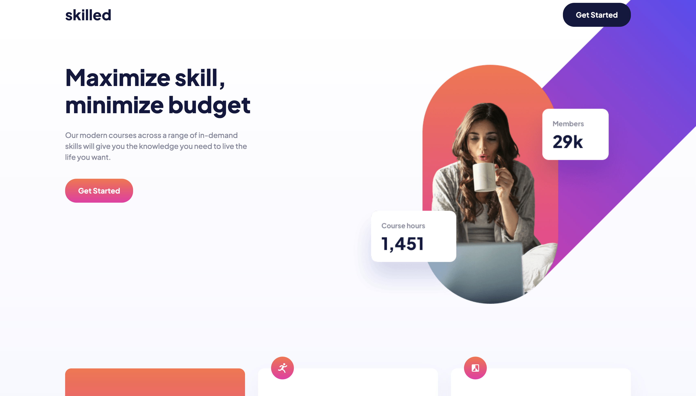
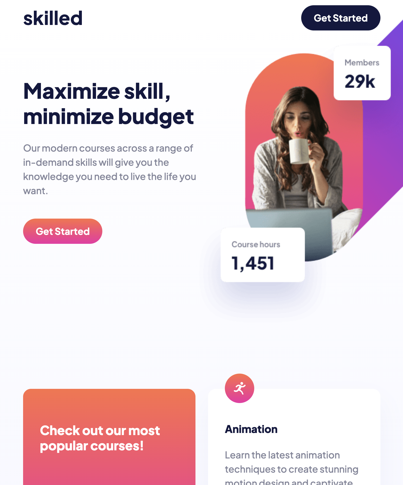
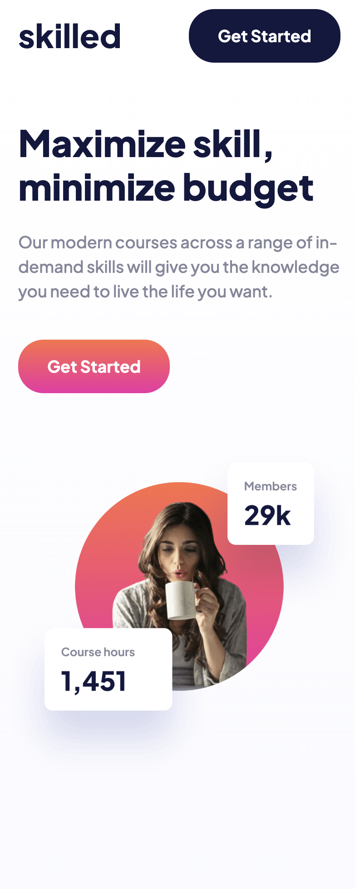

# Skilled eLearning Landing Page

  
  
  
  

   
   

  
  
  

---

## About The Project

This is a responsive landing page for **"Skilled eLearning"**, a modern online course platform focused on high-demand skills like Animation, Design, and Business. The project features a vibrant, gradient-rich UI with a **mobile-first** architecture, ensuring a seamless experience from smartphones to wide-screen desktops.

It demonstrates the use of semantic HTML5, complex CSS Grid layouts for the card section, and the `<picture>` element for art direction—serving different hero image crops depending on the device viewport.

### Key Features

- **Mobile-First Workflow:** Styles are developed for mobile first, then enhanced for Tablet (`768px`) and Desktop (`1440px`) using min-width media queries.
- **CSS Grid Layout:** A responsive grid system that transforms the course cards from a single column on mobile to a 2-column (Tablet) and 3-column (Desktop) layout.
- **Art Direction:** Implementation of the `<picture>` tag to switch between specific image crops (mobile, tablet, desktop) and high-density versions (`@2x`, `@3x`) for sharper visuals.
- **Modern CSS Syntax:** Utilizes native CSS nesting (or SCSS) and CSS Variables (`:root`) for easy theme management (colors, gradients, spacing).
- **Interactive Elements:** Hover states with smooth transitions and gradient shifts for buttons and links.

---

## Screenshots

 
  <h3>Desktop View</h3>
  

 

  

    <h3>Tablet View</h3>
    
  

  

    <h3>Mobile View</h3>
    
  

---

## Built With

- **[HTML5](https://developer.mozilla.org/en-US/docs/Web/HTML)** - Semantic structure (Header, Main, Section, Footer) and accessibility.
- **[SCSS / CSS3](https://sass-lang.com/)** - Uses modern nesting syntax, variables, and media queries.
- **[CSS Grid](https://developer.mozilla.org/en-US/docs/Web/CSS/CSS_Grid_Layout)** - Primary layout engine for the "Popular Courses" card section.
- **[Flexbox](https://developer.mozilla.org/en-US/docs/Web/CSS/CSS_Flexible_Box_Layout)** - Used for the header, footer alignment, and internal card layouts.
